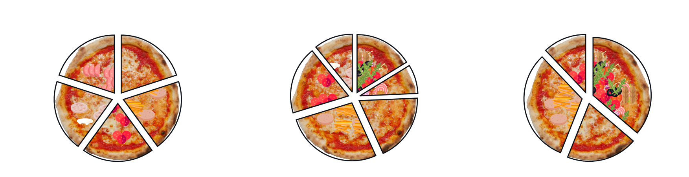

# Pizza chart

Pie charts, with a salty twist.

> [!NOTE] 
> The purpose of this repository is to create a fun data visualization representing the preferred pizzas during pizza days at work. 
> Data and the following summary stats refer to the pizza days at *Polo Territoriale di Lecco, Politecnico di Milano*.

<!-- Adaptation to color scheme taken from https://stackoverflow.com/questions/65413712/changing-readme-md-image-display-conditional-to-github-light-mode-dark-mode -->
<br />
<picture>
  <source media="(prefers-color-scheme: dark)" srcset="https://github.com/Luca-Pozzi/pizza_chart/raw/master/assets/charts/summary_dark.png">
  <source media="(prefers-color-scheme: light)" srcset="https://github.com/Luca-Pozzi/pizza_chart/raw/master/assets/charts/summary_light.png">
  
</picture>
<br />

More stats are available on [GitHub Pages](https://luca-pozzi.github.io/pizza_chart/).

## How to use

> [!IMPORTANT]
> `pizza_chart` comes with built-in images included, which can be freely used for non-commercial purposes (see [license](./LICENSE)).
> In using `pizza_chart`, the user can also use contents from any source, including third-party images. **It is the user's responsibility to give proper attribution to the authors of said contents.**

### Add a pizza
#### Upload a picture
Take a top-view picture of your pizza, ensuring that it is entirely visible.
Follow the tips in [ASSETS.md](./assets/ASSETS.md) to process it to the desired format, size and resolution.

#### Make a pizza with `pizza_maker.ipynb`

### Add a topping
Get the picture of a topping by either:
* cropping a pizza from the images in [`assets/pizza`](./assets/pizzas)
* getting ingredients images from third-party sources ([Flaticon.com](https://www.flaticon.com/) is a great place to look, if you are down with a cartoonish style).

### Plot
Pizza charts can be plotted via the [pizza_chart_example.ipynb](pizza_chart_example.ipynb) notebook.

### Report
Data collected during pizza days at [Politecnico di Milano - Polo Territoriale di Lecco](https://www.polo-lecco.polimi.it/) are available in [data.xlsx](./data/data.xlsx) Excel file.
The [`pizza_report.py`](./pizza_report.py) gathers data from the Excel file to generate summary charts regarding our pizza days. 
The updated summary is displayed at the top of this [`README`](README.md). Individual charts are available in [`assets/charts`](./assets/charts/).

## License
This project is licensed under the [Creative Commons Attribution-NonCommercial 4.0 International License (CC BY-NC 4.0)](LICENSE).

You are free to share and adapt the material for non-commercial purposes, as long as you provide appropriate credit. You can attribute this project as
```
[Pizza chart](https://github.com/Luca-Pozzi/pizza_chart)
```

## Author
* Luca :envelope: [luca6.pozzi@mail.polimi.it](mailto:luca6.pozzi@mail.polimi.it)
